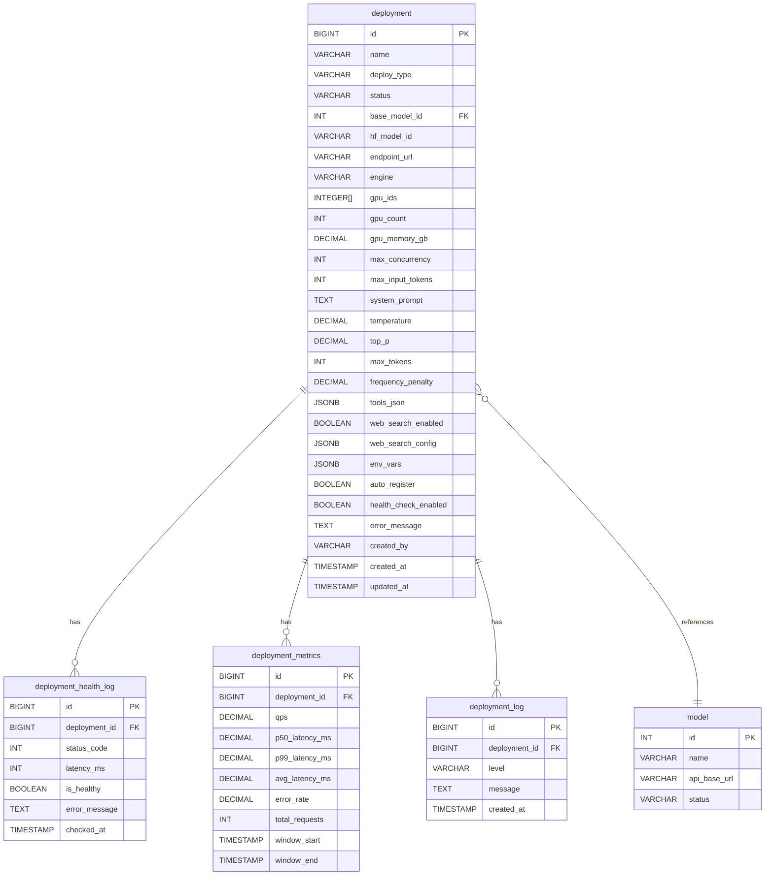

```mermaid
erDiagram
    deployment ||--o{ deployment_health_log : has
    deployment ||--o{ deployment_metrics : has
    deployment ||--o{ deployment_log : has
    deployment }o--|| model : references

    deployment {
        BIGINT id PK
        VARCHAR name
        VARCHAR deploy_type
        VARCHAR status
        INT base_model_id FK
        VARCHAR hf_model_id
        VARCHAR endpoint_url
        VARCHAR engine
        INTEGER[] gpu_ids
        INT gpu_count
        DECIMAL gpu_memory_gb
        INT max_concurrency
        INT max_input_tokens
        TEXT system_prompt
        DECIMAL temperature
        DECIMAL top_p
        INT max_tokens
        DECIMAL frequency_penalty
        JSONB tools_json
        BOOLEAN web_search_enabled
        JSONB web_search_config
        JSONB env_vars
        BOOLEAN auto_register
        BOOLEAN health_check_enabled
        TEXT error_message
        VARCHAR created_by
        TIMESTAMP created_at
        TIMESTAMP updated_at
    }

    deployment_health_log {
        BIGINT id PK
        BIGINT deployment_id FK
        INT status_code
        INT latency_ms
        BOOLEAN is_healthy
        TEXT error_message
        TIMESTAMP checked_at
    }

    deployment_metrics {
        BIGINT id PK
        BIGINT deployment_id FK
        DECIMAL qps
        DECIMAL p50_latency_ms
        DECIMAL p99_latency_ms
        DECIMAL avg_latency_ms
        DECIMAL error_rate
        INT total_requests
        TIMESTAMP window_start
        TIMESTAMP window_end
    }

    deployment_log {
        BIGINT id PK
        BIGINT deployment_id FK
        VARCHAR level
        TEXT message
        TIMESTAMP created_at
    }

    model {
        INT id PK
        VARCHAR name
        VARCHAR api_base_url
        VARCHAR status
    }
```