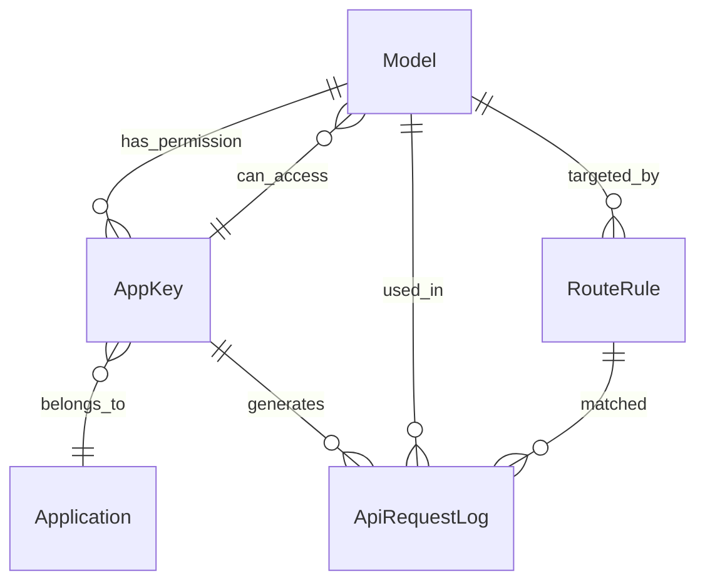
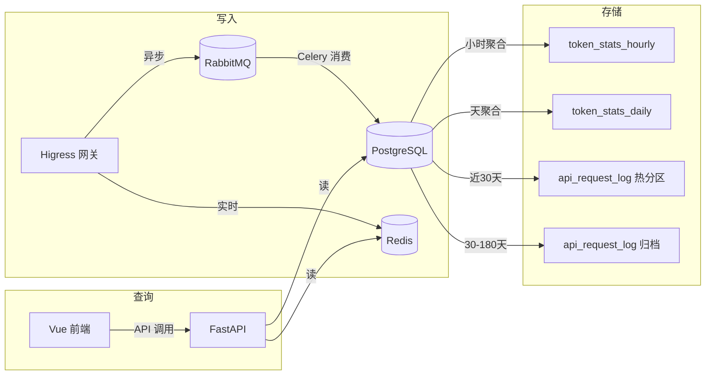

# ER 关系图 — 大模型监测管理平台

## 全局 ER 图

```mermaid
erDiagram
    %% 模型管理
    Model {
        BIGINT id PK
        VARCHAR name "模型名称"
        VARCHAR provider "提供商"
        VARCHAR version "版本"
        VARCHAR api_base_url "API地址"
        VARCHAR api_key_encrypted "加密Key"
        INT qps_limit "QPS上限"
        INT timeout_ms "超时时间"
        INT weight "路由权重"
        VARCHAR status "状态"
        JSONB model_config "模型配置"
        TIMESTAMPTZ created_at
        TIMESTAMPTZ deleted_at
    }
    
    ModelVersion {
        BIGINT id PK
        BIGINT model_id FK
        VARCHAR version "版本号"
        BOOLEAN is_current "是否当前"
        TEXT change_log "变更说明"
    }
    
    ModelHeartbeat {
        BIGINT id PK
        BIGINT model_id FK
        VARCHAR status "状态"
        INT response_time_ms "响应时间"
        TIMESTAMPTZ checked_at "检查时间"
    }
    
    Application {
        BIGINT id PK
        VARCHAR name "应用名称"
        TEXT description
    }
    
    AppKey {
        BIGINT id PK
        VARCHAR name "Key名称"
        VARCHAR key_hash "Key哈希"
        VARCHAR key_prefix "前缀"
        BIGINT application_id FK
        VARCHAR created_by "SSO用户ID"
        INT qps_limit "QPS限制"
        BIGINT token_quota "Token上限"
        BIGINT token_used "已用Token"
        TIMESTAMPTZ expires_at "过期时间"
        VARCHAR status "状态"
        TIMESTAMPTZ last_used_at
    }
    
    AppKeyModel {
        BIGINT id PK
        BIGINT app_key_id FK
        BIGINT model_id FK
    }
    
    RouteRule {
        BIGINT id PK
        VARCHAR name "规则名称"
        VARCHAR path_pattern "路径匹配"
        VARCHAR match_type "匹配方式"
        VARCHAR strategy "策略"
        VARCHAR status "状态"
        INT priority "优先级"
    }
    
    RouteRuleModel {
        BIGINT id PK
        BIGINT route_rule_id FK
        BIGINT model_id FK
        INT priority "优先级"
        INT weight "权重"
    }
    
    ApiRequestLog {
        BIGINT id PK
        VARCHAR request_id "请求ID"
        BIGINT app_key_id FK
        BIGINT model_id FK
        BIGINT route_rule_id FK
        VARCHAR request_path
        INT prompt_tokens "输入Token"
        INT completion_tokens "输出Token"
        INT total_tokens "总Token"
        INT response_time_ms "响应时间"
        INT status_code "状态码"
        VARCHAR client_ip "客户端IP"
        TIMESTAMPTZ created_at "请求时间"
    }
    
    TokenStatsHourly {
        BIGINT id PK
        DATE stats_date "统计日期"
        SMALLINT stats_hour "统计小时"
        VARCHAR dimension_type "维度类型"
        BIGINT dimension_id "维度ID"
        INT request_count "请求次数"
        BIGINT total_tokens "Token总量"
        DECIMAL total_cost "费用"
    }
    
    TokenStatsDaily {
        BIGINT id PK
        DATE stats_date "统计日期"
        VARCHAR dimension_type "维度类型"
        BIGINT dimension_id "维度ID"
        INT request_count "请求次数"
        BIGINT total_tokens "Token总量"
        DECIMAL total_cost "费用"
    }
    
    FinetuneTask {
        BIGINT id PK
        VARCHAR name "任务名称"
        BIGINT base_model_id FK "基座模型"
        BIGINT dataset_id FK "训练数据集"
        BIGINT val_dataset_id FK "验证数据集"
        JSONB hyper_params "超参数"
        VARCHAR status "状态"
        SMALLINT progress "进度"
        DECIMAL loss_value "损失值"
        BIGINT output_model_version_id FK "产出模型版本"
        TEXT error_message "错误信息"
        VARCHAR created_by "创建人"
    }
    
    Dataset {
        BIGINT id PK
        VARCHAR name "数据集名称"
        VARCHAR format "格式"
        INT sample_count "样本数"
        BIGINT file_size "文件大小"
        VARCHAR file_path "存储路径"
        VARCHAR file_hash "文件哈希"
        VARCHAR version "版本号"
        VARCHAR annotation_status "标注状态"
        VARCHAR created_by "创建人"
    }
    
    FinetuneEval {
        BIGINT id PK
        BIGINT task_id FK "任务ID"
        DECIMAL accuracy_before "微调前准确率"
        DECIMAL accuracy_after "微调后准确率"
        DECIMAL bleu_before "微调前BLEU"
        DECIMAL bleu_after "微调后BLEU"
        INT latency_before_ms "微调前延迟"
        INT latency_after_ms "微调后延迟"
        JSONB eval_report "评估报告"
    }
    
    AlertRule {
        BIGINT id PK
        VARCHAR name "规则名称"
        VARCHAR metric_type "指标类型"
        BIGINT threshold_value "阈值"
        VARCHAR threshold_mode "模式"
        SMALLINT warn_at_percent "警告百分比"
        JSONB notify_channels "通知渠道"
        BOOLEAN enabled "是否启用"
    }
    
    AlertLog {
        BIGINT id PK
        BIGINT rule_id FK "规则ID"
        VARCHAR alert_level "级别"
        BIGINT current_value "当前值"
        BIGINT threshold_value "阈值"
        TEXT message "消息"
        BOOLEAN notified "已通知"
    }
    
    AuditLog {
        BIGINT id PK
        VARCHAR user_id "SSO用户ID"
        VARCHAR action_type "操作类型"
        TEXT action_detail "操作详情"
        VARCHAR target_type "对象类型"
        BIGINT target_id "对象ID"
        VARCHAR client_ip "客户端IP"
        VARCHAR result "结果"
        TIMESTAMPTZ created_at "操作时间"
    }

    %% 关系定义
    Model ||--o{ ModelVersion : "has"
    Model ||--o{ ModelHeartbeat : "has_heartbeat"
    Model ||--o{ AppKeyModel : "accessible_by"
    Model ||--o{ RouteRuleModel : "targeted_by"
    Model ||--o{ FinetuneTask : "base_model_of"
    
    Application ||--o{ AppKey : "has_keys"
    AppKey ||--o{ AppKeyModel : "permissions"
    AppKey ||--o{ ApiRequestLog : "generated_logs"
    
    RouteRule ||--o{ RouteRuleModel : "targets"
    RouteRule ||--o{ ApiRequestLog : "matched_logs"
    
    ApiRequestLog ||--o{ TokenStatsHourly : "aggregated_to"
    ApiRequestLog ||--o{ TokenStatsDaily : "aggregated_to"
    
    Dataset ||--o{ FinetuneTask : "used_in"
    FinetuneTask ||--o{ FinetuneEval : "has_eval"
    ModelVersion ||--o{ FinetuneTask : "output_model"
    
    AlertRule ||--o{ AlertLog : "triggers"
    SystemConfig {
        BIGINT id PK
        VARCHAR config_key "配置键"
        TEXT config_value "配置值"
        VARCHAR config_group "分组"
        BOOLEAN encrypted "是否加密"
    }
    
    DatasetVersion {
        BIGINT id PK
        BIGINT dataset_id FK
        VARCHAR version "版本号"
        VARCHAR file_path "文件路径"
        INT sample_count "样本数"
        TEXT change_log "变更说明"
    }
    
    ModelEval {
        BIGINT id PK
        VARCHAR name "评估名称"
        JSONB model_ids "对比模型列表"
        JSONB dimension_weights "维度权重"
        JSONB result "评估结果"
        TEXT recommendation "推荐建议"
    }
    
    ExportTask {
        BIGINT id PK
        VARCHAR task_type "任务类型"
        JSONB params "查询参数"
        VARCHAR status "状态"
        VARCHAR file_path "文件路径"
        VARCHAR file_format "格式"
        TIMESTAMPTZ expires_at "过期时间"
    }
    
    Dataset ||--o{ DatasetVersion : "has_versions"
```

## 核心业务实体关系

```mermaid
erDiagram
    %% 核心业务域 ER 图
    Model ||--o{ AppKey : "has_permission"
    Model ||--o{ RouteRule : "targeted_by"
    
    AppKey }o--|| Application : "belongs_to"
    AppKey ||--o{ Model : "can_access"
    
    AppKey ||--o{ ApiRequestLog : "generates"
    Model ||--o{ ApiRequestLog : "used_in"
    
    RouteRule ||--o{ ApiRequestLog : "matched"
```

## 数据流向图

```mermaid
flowchart LR
    subgraph 写入
        GW[Higress 网关] -->|异步| MQ[(RabbitMQ)]
        MQ -->|Celery 消费| PG[(PostgreSQL)]
        GW -->|实时| R[(Redis)]
    end
    
    subgraph 存储
        PG -->|小时聚合| TSH[token_stats_hourly]
        PG -->|天聚合| TSD[token_stats_daily]
        PG -->|近30天| ARL[api_request_log 热分区]
        PG -->|30-180天| ARL_ARCHIVE[api_request_log 归档]
    end
    
    subgraph 查询
        API[FastAPI] -->|读| PG
        API -->|读| R
        UI[Vue 前端] -->|API 调用| API
    end
```