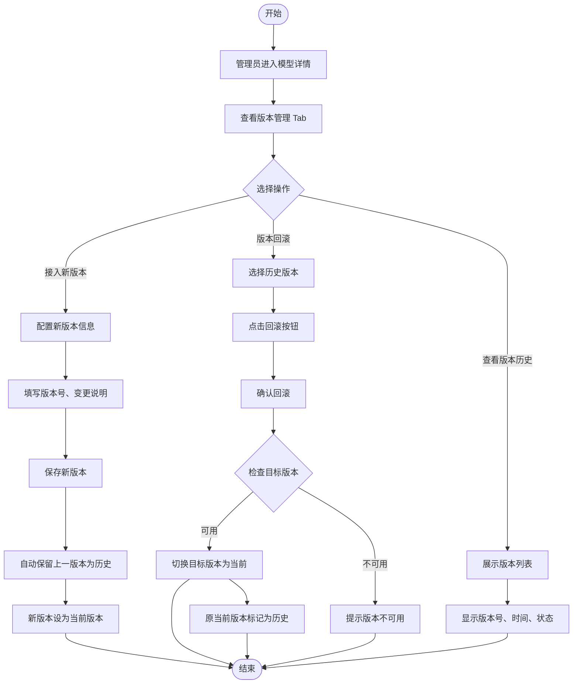

# M01-03 模型版本管理 — 业务流程图

## 流程概述

管理模型的不同版本，记录版本信息，支持版本切换和历史回滚。

## 业务流程图

```mermaid
flowchart TD
    START([开始]) --> A[管理员进入模型详情]
    A --> B[查看版本管理 Tab]
    B --> C{选择操作}
    
    C -->|接入新版本| D[配置新版本信息]
    D --> E[填写版本号、变更说明]
    E --> F[保存新版本]
    F --> G[自动保留上一版本为历史]
    G --> H[新版本设为当前版本]
    
    C -->|版本回滚| I[选择历史版本]
    I --> J[点击回滚按钮]
    J --> K[确认回滚]
    K --> L{检查目标版本}
    L -->|可用| M[切换目标版本为当前]
    M --> N[原当前版本标记为历史]
    L -->|不可用| O[提示版本不可用]
    
    C -->|查看版本历史| P[展示版本列表]
    P --> Q[显示版本号、时间、状态]
    
    H --> END([结束])
    M --> END
    N --> END
    O --> END
    Q --> END
```

## 版本状态

| 状态 | 说明 | 可操作 |
|------|------|--------|
| 当前 | 正在使用的版本 | 不可删除 |
| 历史 | 之前的版本，最多保留10个 | 可回滚、可删除 |